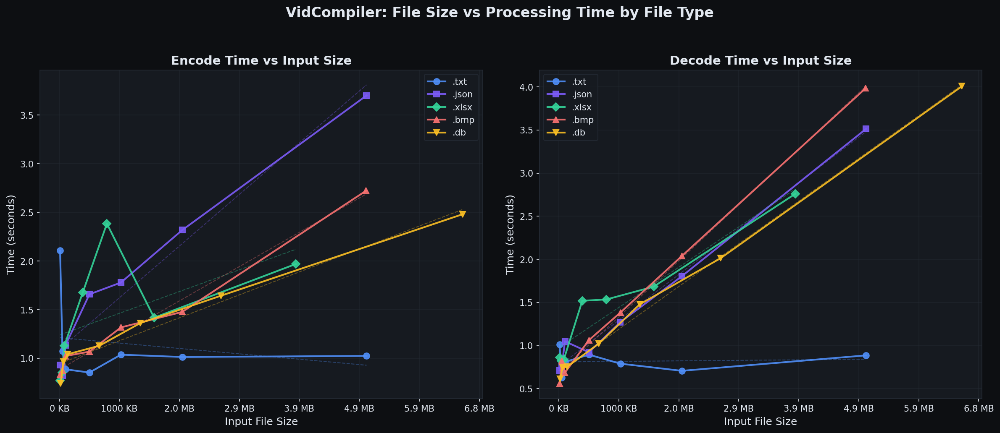

<p align="center">
  <h1 align="center">VidCompiler</h1>
  <p align="center">
    Store any file inside a YouTube video — and recover it perfectly.
    <br />
    A duplicate of <code>dev</code>, kept for history.
  </p>
</p>

> [!IMPORTANT]
> **This branch is byte-for-byte identical to [`dev`](../../tree/dev).**
> `git diff dev optimization-v2` prints nothing. It carries no work that dev
> does not, and it exists only so older links keep resolving.
>
> Like dev, it is the v3 codec (`VIDCMPR3`: 2 bits per 4x4 block on luma, 1 on
> each chroma plane, 40,140 bytes per frame), and **it has never been validated
> against a real YouTube round trip** — every test here decodes a video made by
> this same encoder, which proves nothing about the service.
>
> For a version proven against the live service, use
> [`v7-playlists`](../../tree/v7-playlists).

<p align="center">
  
  
  
  
  
</p>

---

## Branches

| branch | codec | what it adds |
|---|:--:|---|
| [`dev`](../../tree/dev) | v3 | the original single-video pipeline: C pixel engine, FSK audio header, web UI |
| **`optimization-v2`** (this one) | **v3** | identical in content to `dev`; kept only for history |
| [`optimization-v3`](../../tree/optimization-v3) | v4 | the density experiment — 3 bpp on luma. Measured against real YouTube, it loses data |
| [`v5-max-throughput`](../../tree/v5-max-throughput) | v5 | the first format chosen from real round trips, plus a native Reed-Solomon codec |
| [`v6-parallel`](../../tree/v6-parallel) | v5 | sharding across concurrently uploaded videos, and a Windows executable |
| [`v7-playlists`](../../tree/v7-playlists) | v5 | one playlist link per archive, a portable Docker image, faster archiving |
| [`file_explorer`](../../tree/file_explorer) | v5 | a browsable file manager on top of v7, with encryption before upload |
| [`v8-dense-audio`](../../tree/v8-dense-audio) | v8 | 3 levels per luma block instead of 2, and payload carried in the audio track |

v5 through `file_explorer` share one frame format — a video encoded on
any of them decodes on all of them, and what those branches add is
everything *around* the format. `v8-dense-audio` is the first change to
the format itself since v5; it writes a different header, and readers
from v5 onward handle both.

## What each version can and cannot do

The same table appears on every branch. This one is **`optimization-v2`**.

| | `dev`<br>v3 | `optimization-v3`<br>v4 | `v5-max-`<br>`throughput` | `v6-parallel` | `v7-playlists` | `file_explorer` | `v8-dense-`<br>`audio` |
|---|:--:|:--:|:--:|:--:|:--:|:--:|:--:|
| Data per frame | 40,140 B | 64,200 B | 56,100 B | 56,100 B | 56,100 B | 56,100 B | 166,540 B |
| Recovers a file that really went through YouTube | untested | **no** | yes | yes | yes | yes | probe only |
| Verified byte-identical at 1 GB | no | no | yes | yes | yes | yes | local only |
| Threaded, packed-bit pixel engine | no | no | yes | yes | yes | yes | yes |
| Native C Reed-Solomon (32x decode) | no | no | yes | yes | yes | yes | yes |
| Header in audio *and* description | no | no | yes | yes | yes | yes | yes |
| Selectable density profiles | no | no | yes | yes | yes | yes | yes |
| Archives larger than one video | no | no | no | yes | yes | yes | yes |
| One link for a split archive | no | no | no | no | yes | yes | yes |
| Windows executable | no | no | no | yes | yes | yes | yes |
| Docker image | no | no | no | no | yes | yes | yes |
| Browsable file manager | no | no | no | no | no | yes | yes |
| Encryption before upload | no | no | no | no | no | yes | yes |
| Level counts beyond powers of two | no | no | no | no | no | no | yes |
| Payload carried in the audio track | no | no | no | no | no | no | yes |

> "Verified byte-identical at 1 GB" means a single 1 GB video, uploaded to
> YouTube and downloaded back. The **sharded** 1 GB path on `v6-parallel` and
> later is not yet verified end to end — see *the error-correction margin*.
>
> `v8-dense-audio` is the exception and is marked accordingly. Its *format*
> was chosen from a real YouTube upload, which measured the error rate of
> every level count directly, but a complete v8 file has not yet made the
> round trip through the service. Its 1 GB and 3 GB round trips are local.

### What this branch can do

Exactly what [`dev`](../../tree/dev) can do — the two branches are
**identical in content**, byte for byte, and only the names differ. Everything
in dev's description applies here without change.

### What it cannot do

Everything dev cannot do, for the same reasons: the v3 format has never been
validated against a real YouTube round trip, it stores one archive per video,
and Reed-Solomon runs in `galois` rather than the native C decoder.

This branch carries no work that `dev` does not. It is kept so old links keep
resolving; there is no reason to start from it.

## How It Works

```
Files  →  tar.gz  →  Reed-Solomon ECC  →  YUV pixel encoding  →  H.264 video  →  YouTube upload
                                                                                        ↓
Files  ←  untar   ←  RS error correction ←  YUV pixel decoding ←  H.264 decode ←  YouTube download
```

1. **Archive** — Input files are packed into a `.tar.gz` archive with CRC-32 integrity check.
2. **Error Correction** — The archive is split into 215-byte chunks, each protected with 40 bytes of Reed-Solomon parity (RS(255, 215)).
3. **Pixel Encoding** — Corrected data is written into YUV 4:2:0 frames: 2 bits per pixel on the Y plane (4 gray levels) and 1 bit per pixel on the Cb/Cr chroma planes.
4. **Video Encoding** — Frames are piped to ffmpeg as raw YUV and encoded to H.264 with hardware acceleration (QSV / NVENC / AMF) or software fallback (libx264).
5. **Audio Steganography** — A backup copy of the file header is embedded in the audio channel using binary FSK modulation (1,500 Hz / 3,000 Hz).
6. **Upload** — The video is uploaded to YouTube as unlisted via the Data API v3.

Decoding reverses the pipeline: download → extract raw frames → decode pixels → Reed-Solomon correct → verify CRC → extract files.

## Features

- **2.5x data density** over v2 by using all three YUV color planes
- **C native pixel engine** (~9.6 MB/s encode, ~7.2 MB/s decode) with automatic NumPy fallback
- **Hardware encoder auto-detection** — Intel QSV, NVIDIA NVENC, AMD AMF, or software libx264
- **FSK audio channel** — header backup survives even if video frames are partially corrupted
- **Backward compatible** — decodes both v3 (`VIDCMPR3`) and legacy v2 (`VIDCMPR2`) videos
- **Web UI** — drag-and-drop files, real-time progress via SSE, one-click decode

## Requirements

- Python 3.10+
- ffmpeg on PATH (or installed via `imageio-ffmpeg`)
- Google account with YouTube Data API v3 credentials
- *(Optional)* C compiler (MSVC, GCC, or Clang) for maximum pixel throughput

## Quick Start

```bash
# 1. Clone and install
git clone https://github.com/DaniDevML/video_compiler.git
cd video_compiler
pip install -r requirements.txt

# 2. (Optional) Build the C native library for ~7x faster pixel ops
python native/build.py

# 3. Run
python app.py
```

Open [http://localhost:5000](http://localhost:5000) and follow the one-time OAuth setup in the UI.

## Usage

### Encode & Upload

1. Drop any files or folders onto the drop zone.
2. Optionally set a video title.
3. Click **Encode & Upload to YouTube**.
4. Copy the returned URL — you need it to decode later.

### Decode

1. Switch to the **Decode from URL** tab.
2. Paste the YouTube URL or video ID.
3. Click **Download & Decode**.
4. Download the recovered files as a `.zip`.

> **Note:** YouTube takes 2–5 minutes to finish processing the 1080p version after upload. If decoding fails immediately after uploading, wait and try again.

## Architecture

```
video_compiler/
├── app.py              # Flask web server, job management, SSE streaming
├── video_codec.py      # YUV frame encode/decode primitives (v3 + v2 compat)
├── video_encoder.py    # File → H.264/AAC video pipeline
├── video_decoder.py    # H.264/AAC video → file pipeline
├── audio_codec.py      # FSK steganography encoder/decoder
├── youtube_api.py      # YouTube Data API v3 (OAuth, upload, download)
├── native/
│   ├── frame_ops.c     # C pixel encode/decode (hot path)
│   ├── build.py        # Auto-detect compiler and build DLL/.so
│   └── __init__.py     # ctypes loader with fallback detection
├── static/
│   └── index.html      # Single-page web UI
└── requirements.txt
```

## Technical Specs

| Property | Value |
|---|---|
| Resolution | 1920 x 1080 (YUV 4:2:0) |
| Block size | 4 x 4 px |
| Bits per block | Y: 2 bpp (4 gray levels) / Cb, Cr: 1 bpp |
| Data per frame | 40,140 bytes |
| FPS | 30 |
| Error correction | Reed-Solomon RS(255, 215) — 40 parity bytes/chunk |
| Header redundancy | 5 copies with byte-level majority vote |
| Audio channel | Binary FSK at 100 bps (Goertzel demodulation) |
| Video encoder | H.264 via QSV / NVENC / AMF / libx264 (auto-detected) |

### Performance

| Engine | Encode | Decode | vs NumPy |
|---|---|---|---|
| **C native** (MSVC/GCC/Clang) | **~9.6 MB/s** | **~7.2 MB/s** | **~7x faster** |
| NumPy fallback | ~1.4 MB/s | ~1.1 MB/s | baseline |

> Pixel engine throughput only. End-to-end speed is bounded by ffmpeg encoding and network I/O.

### End-to-End Throughput by File Type

<p align="center">
  
</p>

Processing time scales linearly with input size. Compressible formats (.txt, .json) stay fast because gzip shrinks the archive before encoding. Incompressible formats (.bmp, .db) show steeper growth since their full size must be encoded into video frames.

### v3 vs v2

| | v2 | v3 |
|---|---|---|
| Color space | Grayscale (Y only) | YUV 4:2:0 (Y + Cb + Cr) |
| Bits per block | 1 (black/white) | 2 on Y, 1 on Cb/Cr |
| Data per frame | 16,080 B | 40,140 B (**2.5x**) |
| Pixel engine | NumPy only | C native + NumPy fallback |
| Audio channel | — | FSK header backup |
| Header copies | 3 | 5 |

## License

Copyright (C) 2026 DaniDevML

This program is free software: you can redistribute it and/or modify it under
the terms of the **GNU General Public License version 3** as published by the
Free Software Foundation, either version 3 of the License, or (at your option)
any later version. See [LICENSE](LICENSE) for the full text.

This program is distributed in the hope that it will be useful, but WITHOUT ANY
WARRANTY; without even the implied warranty of MERCHANTABILITY or FITNESS FOR A
PARTICULAR PURPOSE.

> Relicensed from MIT, to match the rest of the project.
