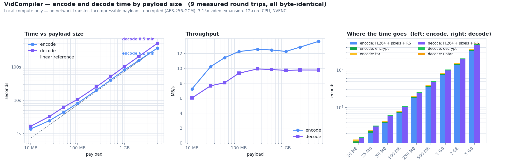

<p align="center">
  <h1 align="center">VidCompiler</h1>
  <p align="center">
    Cloud storage with no cloud storage bill — your files live inside
    YouTube videos.
    <br />
    Encrypted before upload, browsable as an ordinary file manager.
  </p>
</p>

<p align="center">
  
  
  
  
  
  
  
  
  
</p>

**Contents** — [Branches](#branches) · [What each version can and cannot do](#what-each-version-can-and-cannot-do) · [How it works](#how-it-works) · [Quick start](#quick-start) · [Usage](#usage) · [Technical specs](#technical-specs) · [Performance](#performance) · [The v5 format](#the-v5-format-and-why-v4-had-to-change) · [Parallel shards](#parallel-shards) · [v7: one link](#v7-one-link-not-many) · [The file explorer](#the-file-explorer) · [Encryption](#encryption) · [Scaling](#scaling-10-mb-to-5-gb-measured) · [Tests](#tests) · [License](#license)

---

## Branches

| branch | codec | what it adds |
|---|:--:|---|
| [`dev`](../../tree/dev) | v3 | the original single-video pipeline: C pixel engine, FSK audio header, web UI |
| [`optimization-v2`](../../tree/optimization-v2) | v3 | identical in content to `dev`; kept only for history |
| [`optimization-v3`](../../tree/optimization-v3) | v4 | the density experiment — 3 bpp on luma. Measured against real YouTube, it loses data |
| [`v5-max-throughput`](../../tree/v5-max-throughput) | v5 | the first format chosen from real round trips, plus a native Reed-Solomon codec |
| [`v6-parallel`](../../tree/v6-parallel) | v5 | sharding across concurrently uploaded videos, and a Windows executable |
| [`v7-playlists`](../../tree/v7-playlists) | v5 | one playlist link per archive, a portable Docker image, faster archiving |
| **`file_explorer`** (this one) | **v5** | a browsable file manager on top of v7, with encryption before upload |

The frame format has not changed since v5 — a video encoded on
`v5-max-throughput`, `v6-parallel`, `v7-playlists` or `file_explorer` decodes
on all four. What the later branches add is everything around the format.

## What each version can and cannot do

The same table appears on every branch. This one is **`file_explorer`**.

| | `dev`<br>v3 | `optimization-v3`<br>v4 | `v5-max-`<br>`throughput` | `v6-parallel` | `v7-playlists` | `file_explorer` |
|---|:--:|:--:|:--:|:--:|:--:|:--:|
| Data per frame | 40,140 B | 64,200 B | 56,100 B | 56,100 B | 56,100 B | 56,100 B |
| Recovers a file that really went through YouTube | untested | **no** | yes | yes | yes | **yes** |
| Verified byte-identical at 1 GB | no | no | yes | yes | yes | **yes** |
| Threaded, packed-bit pixel engine | no | no | yes | yes | yes | **yes** |
| Native C Reed-Solomon (32x decode) | no | no | yes | yes | yes | **yes** |
| Header in audio *and* description | no | no | yes | yes | yes | **yes** |
| Selectable density profiles | no | no | yes | yes | yes | **yes** |
| Archives larger than one video | no | no | no | yes | yes | **yes** |
| One link for a split archive | no | no | no | no | yes | **yes** |
| Windows executable | no | no | no | yes | yes | **yes** |
| Docker image | no | no | no | no | yes | **yes** |
| Browsable file manager | no | no | no | no | no | **yes** |
| Encryption before upload | no | no | no | no | no | **yes** |

> "Verified byte-identical at 1 GB" means a single 1 GB video, uploaded to
> YouTube and downloaded back. The **sharded** 1 GB path on `v6-parallel` and
> later is not yet verified end to end — see *the error-correction margin*.

### What this branch can do

- Everything [`v7-playlists`](../../tree/v7-playlists) does — same format, same
  sharding, same playlists, same Docker image.
- **Present the whole thing as a file manager.** Folders, upload, preview,
  download, rename, move, delete, search. It looks like ordinary cloud storage.
- **Store no file content whatsoever.** The index holds names, sizes, types and
  the YouTube link each file lives behind. Every byte is on YouTube; the local
  database of a terabyte of files is a few hundred kilobytes.
- **Encrypt before anything leaves the machine.** AES-256-GCM under a
  passphrase, with scrypt key derivation, applied to the archive before it is
  encoded into frames. What YouTube stores is ciphertext.
- **Preview files in the browser** — images, text, PDF, audio, video — by
  fetching and decoding on demand, with a local cache so the second look is
  instant.
- **Handle files up to 5 GB**, measured: nine round trips from 10 MB to 5 GB,
  every one byte-identical, at a flat 12-13 MB/s encode and 9.8 MB/s decode.
  See *Scaling* below for the graph and the memory ceiling behind it.

### What it cannot do

- **Recover an encrypted file if you lose the passphrase.** It is never stored,
  never logged, and never sent anywhere. There is no reset.
- **Preview instantly the first time.** A preview is a real YouTube download
  plus a decode; a large file takes as long as a download takes. Cached
  afterwards.
- **Serve several users.** The index is per-installation and unauthenticated —
  it assumes the localhost or private-network deployment the rest of the
  project assumes. Do not expose it to the internet as-is.
- **Go much past 5 GB on a normal machine.** The pipeline holds whole archives
  in memory as `bytes`, so a 5 GB payload peaks near 15 GB during decode. It
  succeeded on 32 GB of RAM and would not on 16 GB. Streaming through a
  temporary file is the fix and is not done.
- Everything on v7's list still applies: the error-correction margin, the
  playlist scope, the daily upload quota, and software encoding in the
  container.

## How It Works

```
Files  →  tar.gz  →  Reed-Solomon ECC  →  YUV pixel encoding  →  H.264 video  →  YouTube upload
                                                                                        ↓
Files  ←  untar   ←  RS error correction ←  YUV pixel decoding ←  H.264 decode ←  YouTube download
```

1. **Archive** — Input files are packed into a `.tar.gz` archive with CRC-32 integrity check.
2. **Encryption** *(optional)* — The archive is sealed with AES-256-GCM under a passphrase, before anything leaves the machine. See *Encryption* below.
3. **Error Correction** — The archive is split into 215-byte chunks, each protected with 40 bytes of Reed-Solomon parity (RS(255, 215)).
4. **Pixel Encoding** — Corrected data is written into YUV 4:2:0 frames: 2 bits per 4x4 block on the Y plane and 3 bits per 4x4 block on the Cb/Cr chroma planes. The split is deliberate and measured — see *The v5 format* below.
5. **Video Encoding** — Frames are piped to ffmpeg as raw YUV and encoded to H.264 with hardware acceleration (NVENC / QSV / AMF) or software fallback (libx264).
6. **Side channels** — A copy of the header goes into the audio track as FSK tones *and* into the video description, so the decoder can recover the archive parameters three independent ways.
7. **Upload** — The video is uploaded to YouTube as unlisted via the Data API v3.

Decoding reverses the pipeline: download → extract raw frames → decode pixels → Reed-Solomon correct → verify CRC → extract files.

## Features

- **C native pixel engine**, multithreaded, operating directly on packed bits
- **Hardware encoder auto-detection** — NVIDIA NVENC, Intel QSV, AMD AMF, or software libx264
- **Three independent header channels** — pixels, FSK audio, and the video description
- **Sharding across videos** — archives larger than one video split automatically, and parallel uploads run 2.1x faster than a single stream
- **Selectable density** — a `Profile` sets block size and bits per block independently per plane; the header records both, so any profile decodes
- **Backward compatible** — decodes v4 (`VIDCMPR4`), v3 (`VIDCMPR3`), and legacy v2 (`VIDCMPR2`) videos
- **Single executable** — one double-click starts the server and opens the app; no Python, ffmpeg or compiler needed
- **File manager** — folders, upload, preview, download, rename, move, search; the bytes are on YouTube, the index is a few hundred kilobytes
- **Encryption before upload** — AES-256-GCM with scrypt key derivation, so YouTube holds neither your contents nor your filenames
- **Web UI** — drag-and-drop files, real-time progress via SSE, one-click decode

## Requirements

- **Nothing, if you use `VidCompiler.exe`** — Python, ffmpeg and the native library are inside it

To run from source instead:

- Python 3.10+
- ffmpeg on PATH (or installed via `imageio-ffmpeg`)
- Google account with YouTube Data API v3 credentials
- *(Optional)* C compiler (GCC/MinGW, MSVC, or Clang) for the fast pixel path

## Quick Start

### Docker (any machine)

```bash
docker build -t vidcompiler .
```

```bash
docker run -d -p 5000:5000 -v vidcompiler-data:/data vidcompiler
```

Open <http://localhost:5000>. Put `client_secrets.json` in the mounted volume
before first use; the OAuth token and all scratch space live there too.

**Built and tested**, not just written: the image builds clean, serves the page
on the published port, reports `healthy`, and passes the native, Reed-Solomon,
shard and end-to-end suites inside the container. Image is 1.56 GB.

The image deliberately does **not** depend on CUDA or NVENC. Those need the
host's driver and the NVIDIA container runtime, which is precisely the
assumption that stops an image being shareable — so it encodes in software and
runs anywhere. Where a GPU *is* available, pass it through and the encoder
probe finds it on its own:

```bash
docker run -d --gpus all -p 5000:5000 -v vidcompiler-data:/data vidcompiler
```

That choice has a measurable cost, worth knowing before you pick:

| | encoder | expansion |
|---|---|---|
| host with NVENC | `h264_nvenc` | 3.16x |
| container, no GPU | `libx264` | **4.14x** |

Software encoding uploads about **31% more bytes** for the same payload. The
recovered data is identical either way — it is upload time you pay, not
integrity.

> A job needs roughly **7x the payload** free in the mounted volume — the
> uploaded copy, the ~3x encoded video, and the downloaded copy.

### Windows executable

Double-click `VidCompiler.exe`. It starts the server, opens your browser, and
prints the address as a fallback. Put `client_secrets.json` beside it.

```bash
python build_exe.py
```

Produces `dist/VidCompiler.exe` (~143 MB — it carries Python, ffmpeg, numba and
the native library).

### From source

```bash
pip install -r requirements.txt
```

```bash
python native/build.py
```

```bash
python launcher.py
```

> First launch takes about a minute either way: galois compiles its
> Reed-Solomon kernels on first use. The page is up while that happens.

## Usage

### The file manager (the default page)

1. Drop a file anywhere on the page, or click **Upload file**.
2. Tick **Encrypt this file** if you want it sealed, and set a passphrase.
3. Watch it encode and upload. When it finishes, it appears in the listing —
   what is stored on this machine is the name, size and YouTube link.
4. Click a file to open it. The first open fetches and decodes it, which takes
   as long as a download takes; after that it is cached and instant.

Folders, rename, move and search are ordinary metadata operations — moving a
gigabyte between folders is one `UPDATE`, not a copy.

### The raw codec tool (`/codec`)

Unchanged from `v7-playlists`, for working with links directly.

#### Encode & Upload

1. Drop any files or folders onto the drop zone.
2. Optionally set a video title.
3. Click **Encode & Upload to YouTube**.
4. Copy the returned link. A split archive gives you a single playlist link that is all you need.

#### Decode

1. Switch to the **Decode from URL** tab.
2. Paste the link. One playlist link is enough for a split archive; otherwise paste every video URL, one per line.
3. Click **Download & Decode**.
4. Download the recovered files as a `.zip`.

> **Note:** YouTube takes 2–5 minutes to finish processing the 1080p version after upload. If decoding fails immediately after uploading, wait and try again.

## Architecture

```
video_compiler/
├── app.py              # Flask web server, job management, SSE streaming
├── video_codec.py      # YUV frame encode/decode primitives + sidecar header
├── video_encoder.py    # File → H.264/AAC video pipeline
├── video_decoder.py    # H.264/AAC video → file pipeline
├── audio_codec.py      # FSK steganography encoder/decoder
├── youtube_api.py      # YouTube Data API v3 (OAuth, upload, download)
├── native/
│   ├── frame_ops.c     # C pixel encode/decode (hot path)
│   ├── build.py        # Auto-detect compiler and build DLL/.so
│   └── __init__.py     # ctypes loader with fallback detection
├── launcher.py         # One entry point: serve, open the browser, stay up
├── Dockerfile          # Portable image, no CUDA assumption
├── docker-compose.yml  # docker compose up
├── paths.py            # Resource vs user-data paths, frozen or from source
├── shards.py           # Split an archive across parallel videos
├── library.py          # The file explorer's index: names and links, no content
├── crypto_box.py       # AES-256-GCM + scrypt, chunked and authenticated
├── filecache.py        # LRU cache of files fetched back from YouTube
├── build_exe.py        # Build dist/VidCompiler.exe
├── vidcompiler.spec    # PyInstaller recipe
├── bench/              # Benchmarks and test suites (see below)
└── static/
    ├── explorer.html   # The file manager (served at /)
    └── index.html      # The raw codec tool (served at /codec)
```

## Technical Specs

| Property | Value |
|---|---|
| Resolution | 1920 x 1080 (YUV 4:2:0) |
| Block size | 4 x 4 px (both planes) |
| Bits per block | Y: 2 bpp (4 levels) / Cb, Cr: 3 bpp (8 levels) |
| Data per frame | 56,100 bytes (`PROFILE_DENSE`: 128,880) |
| FPS | 30 |
| Error correction | Reed-Solomon RS(255, 215) — 40 parity bytes/chunk |
| Header redundancy | 5 in-frame copies + audio track + video description |
| Audio channel | 4-FSK at 3,150 sym/s = 6,300 bps (652 payload B/s) |
| Max per video | ~1.27 GB (YouTube 15-min cap); larger archives shard automatically |
| Upload quantiser | constqp 44 (see *the quantiser cliff* below) |
| Video encoder | H.264 via NVENC / QSV / AMF / libx264 (auto-detected) |

---

# Performance

All numbers below were produced by the scripts in `bench/` on the machine
listed under *Test system*. Nothing here is estimated. Re-run any of them to
reproduce.

**Test system:** Intel Core i7-8700 (6C/12T), NVIDIA GTX 1060 6 GB, Windows 10,
Python 3.11, ffmpeg 2026-01-14. Payloads are incompressible random bytes — the
worst case, since gzip cannot shrink them before encoding.

## End-to-end: v4 vs v5

`bench/bench_e2e.py`, best of 2–3 runs, byte-identity verified by SHA-256 on
every run.

> These figures were taken while v5 still used v4's 64,200 B/frame geometry, so
> they isolate the *engineering* changes (pixel engine, quantiser, decode
> architecture) from the later format change. The format now carries 56,100 B
> per frame, which shifts the absolute times and the video size a little; the
> real-YouTube table above is the current end-to-end reference.

| Payload | | encode | decode | uploaded video |
|---|---|---|---|---|
| **4 MB** | v4 | 1.21 s | 2.51 s | 23.67 MB |
| | v5 | **0.75 s** | **0.75 s** | **12.45 MB** |
| | | 1.61x | 3.35x | 1.90x smaller |
| **8 MB** | v4 | 2.17 s | 3.92 s | 47.37 MB |
| | v5 | **1.21 s** | **1.17 s** | **24.90 MB** |
| | | 1.79x | 3.35x | 1.90x smaller |
| **16 MB** | v4 | 4.19 s | 7.20 s | 94.72 MB |
| | v5 | **2.14 s** | **1.96 s** | **49.77 MB** |
| | | 1.96x | 3.67x | 1.90x smaller |

In throughput terms at 16 MB: encode went from 4.00 to 7.82 MB/s, decode from
2.33 to 8.57 MB/s.

**The 1.90x size reduction is the number that matters most in practice.** Real
upload and download time is network-bound, not CPU-bound: on a 20 Mbit/s
uplink, the 8 MB case spends ~19 s uploading under v4 against ~10 s under v5,
which dwarfs the ~1 s of encode time either way.

## Real YouTube round trips

`bench/bench_youtube.py` runs the whole thing against the live service: encode,
upload, wait for the 1080p rendition, download, decode, compare SHA-256. This
is the only measurement that actually proves the format works.

| stage | 8 MB payload |
|---|---|
| encode | 1.4 s → 26.5 MB video (3.16x) |
| upload | 18.2 s (11.6 Mbit/s) |
| YouTube processing to 1080p | 24 s |
| download | 5.0 s — YouTube served 20.6 MB |
| decode + error correction | 1.5 s |
| **result** | **bytes identical** |

### Scaling, to 1 GB

| payload | video | upload | processing | download | decode | result |
|---|---|---|---|---|---|---|
| 8 MB | 26.5 MB | 18.2 s @ 11.6 Mbit/s | 24 s | 5.0 s | **1.5 s** | identical |
| 64 MB | 202 MB | 108 s @ 15.7 Mbit/s | 50 s | 8.5 s | 352.7 s* | identical |
| 256 MB | 808 MB | 369 s @ 18.4 Mbit/s | 91 s | 30.6 s | **38.8 s** | identical |
| **1 GB** | **3.38 GB** | **1441 s @ 18.8 Mbit/s** | 246 s | 149 s | **156.5 s** | **identical** |

\* the 64 MB decode predates the native Reed-Solomon decoder. Re-measured on
the same 256 MB video, decode went from **1252 s to 38.8 s — 32x faster**.

A 1 GB archive becomes an 11-minute 1080p video. Note that puts a ceiling on a
single video: YouTube caps unverified accounts at 15 minutes, which at this
profile is about 1.28 GB (56,100 B/frame x 30 fps x 900 s x 215/255).

**YouTube returns less than it was given** — 2.44 GB back from a 3.38 GB
upload. It re-encodes everything, which is why the upload quantiser can be
raised at all, and why a format has to be validated against the service rather
than against our own encoder.

**How hard error correction works.** The decoder records it: on the 8 MB round
trip, 5,353 of 39,031 blocks needed repair (13.71%), averaging 1.28 corrected
symbols each against a per-block capacity of 20. Healthy, but the tail matters
— see the quantiser note below.

### The upload quantiser has a cliff

Raising the quantiser shrinks the upload for free, until abruptly it does not.
Through our own decoder every setting up to qp51 round-trips perfectly. Through
real YouTube:

| upload | expansion | our decoder | real YouTube |
|---|---|---|---|
| qp 44 | 3.16x | clean | **clean** (verified at 8/64/256/1024 MB) |
| qp 51 | 2.75x | clean | **fails** — 22 of 39,031 blocks beyond repair |

Uploading a coarser file degrades the source YouTube re-encodes *from*. The
15% saving at qp51 is not worth the failure, so qp44 ships. This is the clearest
illustration of why the local benchmarks cannot settle a format question.

## Known problem: the error-correction margin is thin

A four-shard 1 GB upload through the web app did **not** recover. Three of the
four videos decoded cleanly; the fourth lost the data outright, with 533,893 of
its 1,248,917 blocks beyond repair. Re-downloading it gave the same result, so
the stored rendition is damaged rather than the transfer.

The cause is not sharding, and not the GUI. It is how little headroom the
default profile leaves:

| shard | delivered video | blocks repaired | result |
|---|---|---|---|
| 0 | **534 MB** | — | **unrecoverable** |
| 1 | 658 MB | 172,332 / 1,248,917 (13.8%) | ok |
| 2 | 658 MB | 172,699 / 1,248,917 (13.8%) | ok |
| 3 | 656 MB | 156,997 / 1,248,917 (12.6%) | ok |

Every shard was the same size going in. YouTube transcoded one of them far
harder than its siblings — 534 MB delivered against ~658 MB — and that was
enough to cross the line. The healthy videos were already spending ~14% of
their blocks on repair, so the normal operating point is closer to the edge
than the small single-video tests suggested (the 8 MB round trip reported the
same 13.7%, which looked fine in isolation).

**The measured fix is `PROFILE_ROBUST`** (Y 4px/2bpp + C 2px/2bpp). Probe 3
put it at a 4.3e-07 bit error rate against the default's 1.1e-05 — 25x the
margin — while also carrying 1.7x more per frame, at about 35% more uploaded
bytes. That trade was rejected when upload was serial and one stream cost
24 minutes per gigabyte; with shards uploading concurrently it looks very
different. Switching the default needs its own round-trip validation, which is
why this is written down rather than already done.

Until then, treat multi-hundred-megabyte uploads on the default profile as
needing verification after the fact, not as guaranteed.

## Where the gains came from

### Pixel engine — 4.2x encode, 13.2x decode

`bench/bench_pixel.py`. Both the old and new C engines are compiled here with
the same `gcc -O3 -march=native`, so this is a like-for-like comparison of the
code rather than of compilers.

| Engine | encode | decode |
|---|---|---|
| NumPy fallback | 4.9 MB/s | 5.7 MB/s |
| v4 C (single-threaded, byte-per-bit) | 25.4 MB/s | 18.5 MB/s |
| v5 C (threaded, byte-per-bit) | 95.2 MB/s | 191.3 MB/s |
| **v5 C (threaded, packed bits)** | **107.8 MB/s** | **244.4 MB/s** |

Three changes: the loops are parallelised across frames with OpenMP; block
rows are built once and replicated with 64-bit stores instead of filling
byte-at-a-time; and the payload is read as packed bits rather than one byte per
bit, which removes an 8x intermediate array (75 MB for an 8 MB payload) from
both sides of the pipeline.

### Upload size — 1.90x smaller, for free

`bench/bench_upload_preset.py`, `bench/sweep_upload_qp.py`. The v4 pipeline
uploaded at `qp 18`. The encoded blocks are flat by construction, so a much
coarser quantiser still reproduces them exactly:

| upload setting | expansion | bit errors |
|---|---|---|
| qp 18 (v4 default) | 4.76x | 0 |
| qp 34 | 3.27x | 0 |
| **qp 44 (v5)** | **2.50x** | **0** |
| qp 47 | 2.30x | 1.7e-05 |
| qp 50 | 2.16x | 5.9e-04 |

Raising the quantiser costs nothing on the far side either: measured through a
simulated YouTube transcode, the recovered error rate is **flat** from qp 18 to
qp 46 (2.39e-01 → 2.43e-01), because YouTube discards our bitstream and
re-encodes from scratch regardless of how carefully we encoded it.

The low-latency NVENC presets (`llhp`) also encode this content at the same
size but noticeably faster than the default preset.

### Decode architecture — 3.4x

Profiling (`bench/profile_decode.py`) showed decode was 94% ffmpeg and only
1.4% pixel work, because the video was being **fully decoded twice** — once to
detect the format and once to read the payload — with ~490 MB of raw YUV staged
to disk each time. Three fixes:

- **Detect on a prefix.** Format detection now decodes only the first 16
  frames instead of the entire video.
- **Stream instead of staging.** Frames are piped straight from ffmpeg rather
  than written to a temp file and read back.
- **Drop CUDA, drop the scale filter.** Measured on this machine
  (`bench/bench_decode_cmd.py`): CPU decode runs at 250 fps against 142 fps
  with `-hwaccel cuda`, because hwaccel has to copy every frame back over PCIe
  to reach system memory. The scale filter was a full-frame no-op whenever the
  video is already 1080p.
- **Batch size.** A batch is read in full before pixel work starts, so batch
  size sets how long ffmpeg sits blocked on a full pipe. 158 fps at 4 frames
  per batch against 62 at 32 and 34 at 64.

### Reed-Solomon — 55x decode, 3x encode

`bench/bench_rs.py`, `bench/test_rs_native.py`. `native/rs.c` implements the
same code galois does — table-driven GF(2^8), syndromes, Berlekamp-Massey,
Chien search, Forney — parallelised across chunks.

| operation | galois | native | |
|---|---|---|---|
| decode | 0.8 MB/s | **44.2 MB/s** | 55x |
| encode | 52 MB/s | **153 MB/s** | 3x |

This is the single largest win in the project, because decode is where the
time actually went. Off YouTube the payload always carries some errors, so the
cheap path (strip parity, check CRC) never fires on a large archive and every
block goes through correction. Measured on the same 256 MB video: **1252 s
before, 38.8 s after**.

Matching galois bit-for-bit matters, since existing videos were encoded with
it. `bench/test_rs_native.py` checks agreement at every error count from zero
to the correction limit, past it, and on burst patterns, and confirms an
uncorrectable block is *reported* rather than silently returned as wrong bytes.
galois remains the fallback when the C library is unavailable.

---

# The v5 format, and why v4 had to change

**The v4 format did not survive YouTube.** A real 8 MB round trip failed its
integrity check after error correction. This was not a marginal failure: the
luma plane came back with a 3.6e-02 bit error rate, far past what RS can
repair. v4 had only ever been validated against our own encoder, which
reproduces the blocks exactly and therefore proves nothing about the service.

Three probe uploads then measured the real channel. Each test video is built
from consecutive segments modulated at different densities, so a single round
trip measures a whole ladder (`bench/diag_youtube_formats.py`).

## What the real channel does

| format | B/frame | overall | Y | Cb | Cr |
|---|---|---|---|---|---|
| Y 8px/2bpp + C 8px/1bpp | 9,930 | 0 | 0 | 0 | 0 |
| Y 4px/1bpp + C 4px/1bpp | 24,060 | 0 | 0 | 0 | 0 |
| Y 4px/2bpp + C 4px/2bpp | 48,120 | 2.3e-05 | 3.4e-05 | 0 | 0 |
| **Y 4px/3bpp + C 4px/2bpp** (v4) | **64,200** | **3.6e-02** | **4.8e-02** | 0 | 0 |
| Y 4px/4bpp + C 4px/3bpp | 88,260 | 1.4e-01 | 1.9e-01 | 0 | 0 |

Two findings, neither of which the simulation predicted:

1. **Chroma is far more robust than luma.** It came back *bit-perfect* at every
   density tried, up to 3 bits per block. Every failure above is a luma
   failure. v4 broke for exactly one reason: 3 bpp on the Y plane.
2. **Luma needs contrast, not area.** 2x2 blocks at 1 bpp -- pure black and
   white -- returned zero errors, while 4x4 blocks at 3 bpp did not. What
   survives a transcode is the spacing between levels, not the size of a block.

## Density and upload size pull opposite ways

Following those findings upward gives formats carrying far more per frame. But
high-contrast 2x2 blocks are the most expensive thing a video codec can be
asked to represent, so the frames themselves get much bigger
(`bench/bench_profile_size.py`):

| profile | B/frame | expansion | YouTube BER |
|---|---|---|---|
| **Y 4px/2bpp + C 4px/3bpp** (default) | 56,100 | **2.34x** | 1.1e-05 |
| Y 4px/2bpp + C 2px/2bpp | 96,480 | 3.15x | 4.3e-07 |
| Y 2px/1bpp + C 2px/2bpp (`PROFILE_DENSE`) | 128,880 | 4.81x | 1.6e-07 |

End-to-end time is dominated by bytes on the wire, not frame count. On the
measured 12 Mbit/s uplink an 8 MB payload costs about 12.5 s of upload at 2.34x
against 25.7 s at 4.81x, while the extra frames of the sparse profile cost well
under a second of CPU. So **the default optimises for total bytes**, and
`PROFILE_DENSE` is exposed for the case where frame count is what matters --
fitting a very large archive inside YouTube's per-video duration limit.

The default carries 87% of v4's bytes per frame, uploads *smaller* per payload
byte than v4 did, and unlike v4 it actually round-trips.

## Things that were tried and did not work

- **Adaptive demodulation.** `bench/sweep_adaptive.py` recalibrated the slicer
  per frame from the observed level distribution, on the theory that the
  transcode applies a gain shift the fixed thresholds miss. It changed nothing
  (1.65e-01 fixed against 1.65e-01 adaptive) -- the damage is per-block
  information loss, not a correctable level shift.
- **Trusting the simulation.** The local ffmpeg channel model in
  `bench/channel.py` did correctly predict that v4 would fail, but for the
  wrong reason: it mangles chroma, which the real service leaves untouched. It
  is kept for fast iteration, but no format decision should rest on it.

## The side channels, in proportion

The audio track and the video description are genuinely useful, but not for
capacity — and it is worth being precise about the scale:

| channel | payload rate | share of total |
|---|---|---|
| Pixels | 1,926,000 bytes/s | 99.989% |
| Audio (FSK) | 215 bytes/s | 0.011% |
| Description | ~3.7 KB, one-off | ~0% |

Their real value is redundancy and speed of decode:

- **Video description.** YouTube stores it verbatim, making it the one
  perfectly lossless channel available. v5 puts a base64 header there, so the
  decoder learns the archive size, frame count and CRC without decoding and
  scanning any frames. Malformed or absent descriptions fall back cleanly.
- **Audio track.** v4 wrote an FSK header copy but **nothing ever read it**,
  and a length-framing bug made exact recovery impossible regardless — the
  decoder could not distinguish payload from the zero padding added to fill the
  last RS chunk. v5 fixes the framing, wires it in as a last-resort fallback,
  and raises the symbol rate from 100 to 2,100 bps after verifying exact
  recovery through a real AAC round-trip down to 64 kbps.

---

# Parallel shards

An archive can be split across several videos: built once, cut into contiguous
slices, each slice encoded as an independent video carrying a manifest (the
whole-archive length and CRC, plus this shard's offset) in its description.

```python
import shards
jobs = shards.encode_files_to_shards(['big.iso'], 'out/', n_shards=4)
shards.decode_shards_to_files(paths, 'recovered/', descriptions)
```

Shards may be supplied in any order — the manifest puts them back. A missing
shard, or one belonging to a different upload, is rejected rather than silently
producing a corrupt archive.

## Why it is worth it: parallel upload

Upload dominates end-to-end time at any real size, and one HTTP stream does not
saturate the link. Measured against the live service, three shards uploaded
concurrently (`bench/bench_shards_upload.py`):

| | throughput |
|---|---|
| one stream (measured on 256 MB and 1 GB uploads) | 18.6 Mbit/s |
| **three concurrent streams, aggregate** | **39.9 Mbit/s** |
| each individual stream | 13.4 Mbit/s |

**2.14x.** Per-stream throughput drops, but the aggregate more than doubles —
YouTube throttles each stream rather than the connection. Download parallelises
too: 189.8 Mbit/s aggregate across three streams.

A complete 96 MB sharded round trip: encode 10.9 s, upload 63.8 s, processing
48 s, download 10.5 s, decode 11.9 s, bytes identical.

## Why local parallelism barely helps

Sharding the *compute* is much less dramatic (`bench/bench_shards.py`, 64 MB):

| shards | encode | decode |
|---|---|---|
| 1 | 8.47 s | 7.83 s |
| 2 | 6.87 s | 6.61 s |
| 3 | **6.70 s** | 6.70 s |
| 4 | 6.72 s | 7.02 s |

It saturates at two or three: consumer NVENC caps concurrent sessions, and the
pixel and Reed-Solomon stages already use every core, so extra shards just
re-divide the same CPU. 1.26x encode, 1.18x decode — worth having, but the
upload is where sharding actually pays.

## The audio channel, now M-ary

Each symbol is one of M tones carrying log2(M) bits. Three constraints
interact: orthogonality needs tone spacing >= the symbol rate; AAC low-passes
around 15 kHz, capping M * spacing; and AAC's transform smears very short
symbols, putting a floor on symbol duration that has nothing to do with
bandwidth.

Those bound throughput at log2(M)/M * B, which peaks near M = 3 — so theory
says M-ary FSK should barely beat binary. Sweeping every viable combination
through a real AAC 128k round trip (`bench/sweep_audio_mary.py`) agrees:

| | symbol rate | raw | payload |
|---|---|---|---|
| **4-FSK** (shipping) | 3,150/s | 6,300 bps | **652 B/s** |
| 8-FSK | 1,575/s | 4,725 bps | 448 B/s |
| 2-FSK | 4,410/s | 4,410 bps | 430 B/s |

4-FSK at 3,150 sym/s is the bandwidth-limited optimum — one symbol rate higher
pushes the top tone past AAC's cutoff. **2.9x the previous binary setting.**

That sweep also surfaced a bug: sections were modulated as a single bit stream,
so whenever `BITS_PER_SYMBOL` did not divide a section length the payload began
mid-symbol while the decoder read it at a symbol offset. Every 8-FSK
configuration failed, which looked exactly like a channel limit. Each section
is now modulated separately.

Scale, honestly: 652 B/s against the pixel channel's 1.68 MB/s is **0.04% of
total capacity**. The audio channel's value is redundancy — it carries a backup
header — not throughput.

---

# v7: one link, not many

An archive split across several videos used to leave you holding a list of
URLs, **every one of which is required** — lose one and the archive is gone.
v7 collects them into an unlisted YouTube playlist and hands back a single
link. The playlist also records the order, which is exactly what the decoder
needs, so pasting that one link is enough:

```
https://www.youtube.com/playlist?list=PLcu_a8cy1Xns
```

Decoding reads the playlist with yt-dlp rather than the Data API, so it needs
no credentials at all — an unlisted playlist is readable by link, and requiring
OAuth to read something the link already grants would be a poor trade.

**Encoding a playlist does need a wider permission** than uploading: the
`youtube` scope rather than `youtube.upload` alone. The first run after
upgrading asks for it. If only the narrower grant is available the upload still
succeeds and the individual video links are returned instead, with a warning
that all of them are needed.

Verified without spending an upload — creating a playlist costs a fraction of
what a video does, so `bench/test_playlist.py` builds one from videos already
on the channel, adds them **in reverse order**, reads it back by link, and
checks the archive still reassembles byte-identically. The manifest sorts the
order out.

## Faster archiving

gzip on incompressible input is pure loss: it costs time and produces a file no
smaller. The archive stage now samples a couple of megabytes first and skips
compression when it will not help.

| input | before | after |
|---|---|---|
| incompressible, 128 MB | 31.9 MB/s | **190.9 MB/s** |
| compressible, 128 MB | — | 397 MB/s, archive 0.5% of input |

About 28 seconds off a gigabyte. Compressible input is unaffected — it still
compresses, and the decoder accepts either form.

## Uploads start before encoding finishes

Encoding used to complete for every shard before the first upload began.
Uploads now start the moment each shard is encoded, so the first one begins
roughly 25 seconds in rather than 95.

---

# The file explorer

The rest of this project is a codec that hands you a URL. This branch puts a
file manager in front of it, so the thing behaves like storage rather than
like a tool.

Upload a file and it appears in a listing with a name, a size and a date. Put
it in a folder. Rename it. Search for it. Click it and it opens. None of which
is remarkable — except that **none of those files are here.**

## Nothing is stored locally

The index is a SQLite table of rows like this one:

| name | size | mime | encrypted | url | shards |
|---|---|---|---|---|---|
| `quarterly.pdf` | 5,000,000 | `application/pdf` | 0 | `https://youtu.be/...` | 1 |

There is no content column and no blob on disk. A terabyte of files is a few
hundred kilobytes of index — the seeded three-entry database in the test suite
is 20 KB, and it does not grow with file size at all.

Folders are equally imaginary: a `parent_id` on a row. Nothing on disk mirrors
the tree, so moving a gigabyte between folders is one `UPDATE` statement.

The footer says exactly what is going on, and does not round it in the
project's favour:

```
2 files · 1 folder   9.0 MB stored on YouTube (31 MB uploaded)
index: 20 KB on this machine   1 encrypted   cache: 336 B
```

"31 MB uploaded" against 9 MB of files is the expansion this codec costs. It
is measured per file at upload time, not estimated.

## Opening a file is a real download

A preview is a YouTube download, a full frame decode, Reed-Solomon repair and
a decryption. For a large file that is minutes, and no amount of interface
polish changes it. Two things make it bearable:

- **The result is cached.** The second open is instant. The cache is capped
  (2 GB by default, `VIDCOMPILER_CACHE_MB`) and evicted least-recently-used.
  Eviction is never data loss: every entry can be rebuilt from YouTube.
- **Previews are streamed with byte ranges**, so a cached video or audio file
  seeks in the browser instead of restarting.

Images, video, audio, PDF and text render inline. Text is capped at 1 MB in
the viewer — a browser asked to lay out a 200 MB log simply stops.

> **The cache holds plaintext**, including of encrypted files. That is the
> honest cost of being able to preview them at all. It is capped, evicted, and
> there is a **clear** button next to the cache figure in the footer.

## Deleting does not delete

Removing a file drops the index row and leaves the video on YouTube, and the
response hands back the links it just orphaned. That way a misclick costs you
a paste into `/codec`, not the file.

Deleting the videos themselves is a separate checkbox, labelled as
irreversible, and it is the only thing in the codebase that calls
`videos.delete`. Nothing invokes it implicitly.

---

# Encryption

An unlisted YouTube video is **not private**. Anyone with the link can fetch
it, YouTube keeps it, and the entire premise of this project is that the bytes
are recoverable. Encryption is what turns "recoverable by anyone" into
"recoverable by you".

The archive is sealed **before** it becomes frames, so what YouTube holds is
not your file contents, not the tar structure, and not your filenames. The
test suite asserts that last point directly: a file called
`confidential-filename.txt` containing the word `CONFIDENTIAL` produces
uploaded bytes containing neither string.

## The construction

AES-256-GCM over 1 MiB chunks, keyed by scrypt (N=2^15, r=8, p=1 — about
32 MB and a tenth of a second per file).

Chunking is not an optimisation. GCM has a hard limit near 64 GB per
(key, nonce) pair, and a single tag over a multi-gigabyte ciphertext would
mean buffering unverified plaintext before it could be checked. Per-chunk tags
let the decoder reject damage as it goes.

But per-chunk tags open three holes that a single tag does not, so each chunk's
associated data binds:

| bound in | closes |
|---|---|
| the file header | swapping the KDF parameters for weaker ones |
| the chunk index | reordering or duplicating chunks |
| a final-chunk flag | truncating the stream |

`bench/test_crypto.py` performs each of those attacks and requires a specific
exception, not merely a failure — including splicing in a chunk from a
*different file encrypted under the same passphrase*, which authenticates
perfectly on its own and is rejected only by the index binding.

## Checking the passphrase before the download

A wrong passphrase discovered after a five-minute download is a bad
experience, so the index stores a verifier.

It runs the same scrypt as the real key and hashes the result with a domain
separator. A fast hash here would have been a serious mistake: it would hand
an attacker a cheap oracle for a passphrase otherwise protected by a 32 MB
KDF. As built, guessing against a stolen index costs exactly what guessing
against the ciphertext costs — and the salt it uses is the ciphertext's own,
which is public anyway, sitting in the header inside a video whose link is in
the same index.

## What it does not do

- **There is no recovery.** The passphrase is never stored, never logged and
  never leaves the machine. Lose it and the file is gone.
- **The index is not encrypted.** Filenames, sizes and links are in plain
  SQLite on your disk. Anyone with that file learns what you have and where it
  is — they just cannot read it.
- **It is single-user and unauthenticated**, like the rest of the project. It
  assumes the localhost or private-network deployment everything else here
  assumes. Do not expose it to the internet as it stands.

## The explorer, end to end at five sizes

`bench/test_explorer_sizes.py` drives a **real waitress server** — configured
exactly as `launcher.py` configures it — over real HTTP, with multipart
uploads streamed from disk and real SSE progress. Upload, store, list, fetch,
decode, decrypt, download, and check the SHA-256.

Only the four YouTube transport calls are substituted, by a local directory
standing in for the channel. The videos written there are the same H.264 files
that would have been uploaded, decoded from disk exactly as they would be
after a download.

```bash
python bench/test_explorer_sizes.py
```

| payload | encrypted | store | fetch | videos | uploaded | second open |
|---|:--:|---|---|:--:|---|---|
| 1 MB | no | 7.8 s* | 0.6 s | 1 | 3.17x | 32 ms |
| 10 MB | yes | 1.8 s | 2.5 s | 1 | 3.16x | 94 ms |
| 100 MB | no | 8.0 s | 9.4 s | 2 → playlist | 3.16x | 16 ms |
| 500 MB | yes | 42.3 s | 53.2 s | 2 → playlist | 3.16x | 80 ms |
| 1 GB | yes | 87.2 s | 110.0 s | 4 → playlist | 3.16x | 80 ms |

\* the first run pays for ffmpeg probing and JIT warm-up; the 10 MB row four
seconds later is the honest small-file figure.

**62 checks, all passing.** Every payload came back byte-identical. Each
encrypted case also confirms the wrong passphrase is refused *before* any
download begins, and every multi-shard case confirms the videos were collected
into a single playlist link rather than handed back as a list.

The last line of the run is the branch's whole argument in one measurement:

```
5 files, 1611 MB of content, 5083 MB uploaded, index 20 KB
```

1.6 GB of files, indexed in **20 KB** on the local disk — and the 20 KB does
not grow with file size.

---

# Scaling: 10 MB to 5 GB, measured

Nine round trips through the explorer's full pipeline — tar, AES-256-GCM,
Reed-Solomon, YUV frames, H.264, and all of it backwards. **Every one verified
byte-identical by SHA-256.** Reproduce with:

```bash
python bench/bench_sizes.py
```

<p align="center">
  
</p>

| payload | video | encode | decode | enc MB/s | dec MB/s | videos | result |
|---|---|---|---|---|---|---|---|
| 10 MB | 32 MB | 1.4 s | 1.7 s | 7.2 | 6.0 | 1 | identical |
| 25 MB | 79 MB | 2.4 s | 3.3 s | 10.2 | 7.6 | 1 | identical |
| 50 MB | 158 MB | 4.4 s | 6.2 s | 11.4 | 8.1 | 1 | identical |
| 100 MB | 316 MB | 8.2 s | 10.7 s | 12.2 | 9.3 | 2 | identical |
| 250 MB | 789 MB | 20.0 s | 25.2 s | 12.5 | 9.9 | 2 | identical |
| 500 MB | 1.58 GB | 40.2 s | 50.9 s | 12.5 | 9.8 | 2 | identical |
| 1 GB | 3.16 GB | 81.6 s | 102.9 s | 12.3 | 9.7 | 4 | identical |
| 2 GB | 6.31 GB | 155.9 s | 204.9 s | 12.8 | 9.8 | 4 | identical |
| 5 GB | 15.77 GB | 367.4 s | 512.4 s | 13.6 | 9.8 | 4 | identical |

> **Local compute only.** No network transfer is included. Upload is by far the
> largest term at any real size — a gigabyte to YouTube measured 1441 s against
> these 82 s of encoding — and the daily quota makes a 5 GB upload sweep
> impossible. These numbers answer "how long does my machine take", not "how
> long until my file is on YouTube". For the network path see
> *Real YouTube round trips* above.

Payloads are incompressible random data, encrypted. That is the worst case for
the archive stage and the densest possible input to the frame encoder, and it
is what the explorer actually sees, since encryption makes everything
incompressible before it reaches the codec.

## What the measurements show

**The pipeline is linear.** Encode holds 12–13 MB/s and decode 9.8 MB/s from
100 MB all the way to 5 GB — a 50x range in which throughput moves by under
10%. The curve tracks the linear reference on the log-log plot with no knee.
Sharding does not disturb it either: 1, 2 and 4 videos all sit on the same
line.

**Decode is consistently ~1.4x slower than encode**, and the stage breakdown
says why: it is not the error correction and not the cryptography. Encryption
costs about 1% of encode time (AES-NI runs at multiple GB/s); tar and untar are
smaller still. Essentially all of both bars is H.264 plus the pixel codec plus
Reed-Solomon, and decode carries the extra work of *finding* and repairing
errors rather than just adding parity.

**Small payloads are dominated by fixed costs.** 10 MB runs at 7.2 MB/s
against 13.6 MB/s at 5 GB — ffmpeg startup and per-video overhead that a large
payload amortises away. The benchmark runs an unrecorded warm-up pass first,
so this is genuine per-video overhead and not JIT compilation.

**5 GB works, and it is close to a real ceiling.** It produced 15.77 GB of
video across 4 videos in 6.1 minutes, and read it back in 8.5. The limit is
memory, not time: the pipeline holds whole archives in RAM as `bytes`, so a
5 GB payload peaks around 15 GB during decode (recovered ciphertext, then
plaintext archive, then extraction). It completed on a 32 GB machine with
~19 GB free. On 16 GB it would not, and `bench_sizes.py` records a
`MemoryError` as a result rather than hiding it. Streaming the archive through
a temporary file instead of a `bytes` object is the fix, and it is not done.

---

# Tests

```bash
python bench/run_all.py
```

| suite | covers |
|---|---|
| `test_native.py` | C engine matches NumPy pixel-for-pixel; packed and byte-per-bit paths agree; survives noise up to half the level spacing |
| `test_rs_native.py` | The C Reed-Solomon codec agrees with `galois` on clean, corrupted and uncorrectable inputs |
| `test_e2e.py` | Files → video → files byte-identical, across empty, tiny, compressible, incompressible and multi-file payloads |
| `test_shards.py` | Shards supplied out of order, one missing, and shards from two uploads mixed — each detected rather than silently reassembled wrong |
| `test_sidecar.py` | Description header round-trips; malformed input never raises; decoding identical with, without, and with a corrupt sidecar |
| `test_audio.py` | Exact recovery through real AAC at 128/96/64 kbps, across RS chunk boundaries |
| `test_audio_fallback.py` | Header recoverable from the audio track alone |
| `test_compat.py` | Videos encoded by the previous release still decode byte-identically |
| `test_crypto.py` | Round trips at every chunk boundary, and rejection of the wrong passphrase, a flipped bit, a weakened KDF parameter, truncation, reordering, duplication, and a chunk spliced from another file under the same key |
| `test_library.py` | Name collisions, folder cycles, cascading deletes, breadcrumbs; and that no row holds file content |
| `test_explorer_api.py` | Every HTTP route, chiefly the refusals — serving an unfetched file, a missing id, a folder as a file, a fetch with no passphrase or the wrong one |
| `test_explorer_e2e.py` | File → archive → encrypt → video → decrypt → file, byte-identical, including across three shards; and that neither the contents nor the filename appear in the uploaded bytes |

Two heavier runs sit outside `run_all.py`, because they take minutes rather than seconds:

| run | covers |
|---|---|
| `bench/test_explorer_sizes.py` | The explorer over real HTTP at 1 MB - 1 GB: upload, index, playlist, fetch, decrypt, download, SHA-256 |
| `bench/bench_sizes.py` | The scaling sweep above, 10 MB - 5 GB, verifying every round trip |

All twelve suites pass on this branch.

The benchmark and sweep scripts (`bench_*.py`, `sweep_*.py`, `diag_*.py`,
`profile_*.py`) are separate from the tests and reproduce every number in this
README.

## Version History

| | v2 | v3 | v4 | v5 (v5/v6/v7/file_explorer) |
|---|---|---|---|---|
| Colour space | Grayscale | YUV 4:2:0 | YUV 4:2:0 | YUV 4:2:0 |
| Bits per block | 1 | 2 Y / 1 C | 3 Y / 2 C | **2 Y / 3 C** |
| Data per frame | 16,080 B | 40,140 B | 64,200 B | 56,100 B |
| Survives real YouTube | untested | untested | **no** (3.6e-02 BER) | **yes** (1.1e-05) |
| Format chosen by | — | — | local encoder only | **real round trips** |
| Pixel engine | NumPy | C single-thread | C single-thread | C threaded, packed bits |
| Reed-Solomon | galois | galois | galois | **native C (55x decode)** |
| Upload quantiser | qp 18 | qp 18 | qp 18 | **qp 44** |
| Decode passes | 2 | 2 | 2 | **1 (streamed)** |
| Audio channel | — | header (never read) | header (never read) | **2,100 bps, read as fallback** |
| Description channel | — | — | — | **header sidecar + shard manifest** |
| Audio channel rate | — | 100 bps | 100 bps | **6,300 bps (4-FSK)** |
| Multi-video sharding | — | — | — | **yes, parallel (2.1x upload)** |

This branch adds no format change of its own — the file explorer and its
encryption sit entirely above the codec, which is why a file stored here
decodes on `v5-max-throughput` too (given the passphrase).

v5 carries 13% fewer bytes per frame than v4 and is the first version that
actually round-trips through the service. `PROFILE_DENSE` carries 128,880 B per
frame — 2.0x v4 — at roughly twice the uploaded size.

## License

Copyright (C) 2026 DaniDevML

This program is free software: you can redistribute it and/or modify it under
the terms of the **GNU General Public License version 3** as published by the
Free Software Foundation, either version 3 of the License, or (at your option)
any later version. See [LICENSE](LICENSE) for the full text.

This program is distributed in the hope that it will be useful, but WITHOUT ANY
WARRANTY; without even the implied warranty of MERCHANTABILITY or FITNESS FOR A
PARTICULAR PURPOSE.

> Relicensed from MIT. Note that GPL-3.0 is copyleft: anyone distributing a
> modified version must release their changes under the same licence. If you
> also want that obligation to apply to people who run a modified version as a
> network service without distributing it, use the GNU **Affero** GPL (AGPL-3.0)
> instead — it is a drop-in swap of this file.
